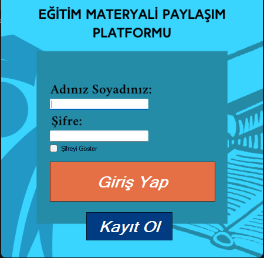
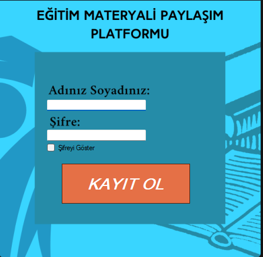
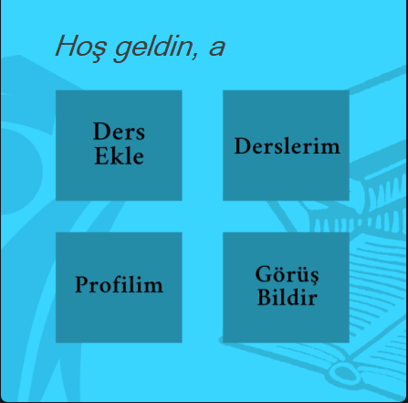
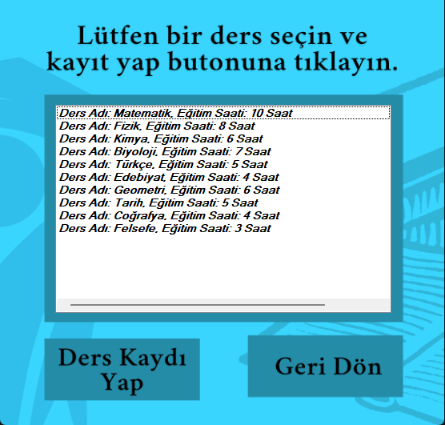
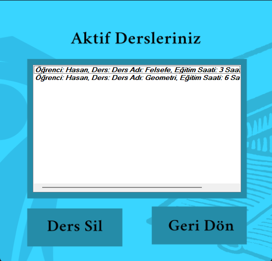
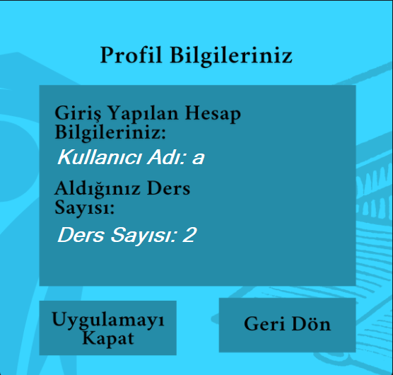

# 📚 Eğitim Materyali Platformu

Bu proje, **C# Windows Forms** kullanılarak geliştirilmiş bir **Eğitim Materyali Platformu** uygulamasıdır. Kullanıcılar, sistem üzerinden çeşitli eğitim materyallerini görüntüleyebilir, ders içeriklerini inceleyebilir, yeni materyaller ekleyebilir ve yorum yapabilir. Proje eğitim amaçlıdır.

## 🧩 Özellikler

- Eğitim materyallerini listeleme  
- Ders içeriklerini detaylı görüntüleme  
- Yeni materyal ekleme  
- Materyallere yorum yapma  
- Basit ve kullanıcı dostu arayüz  

## 🛠️ Kullanılan Teknolojiler

- C# (Windows Forms)  
- .NET Framework  
- Visual Studio  
- (Opsiyonel: JSON, XML ya da SQL Server ile veri saklama)  

## 🖼️ Uygulama İçi Ekran Görüntüleri

  
  
  
  
  
  

